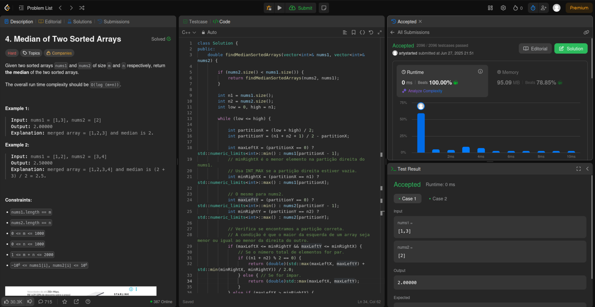
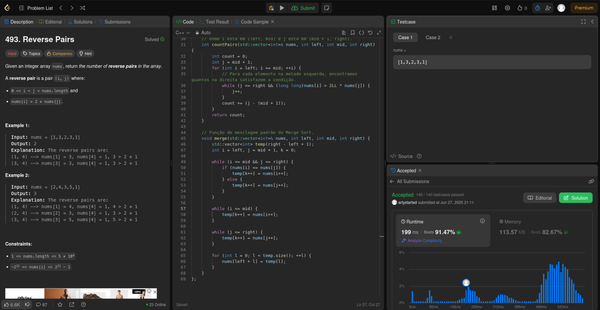
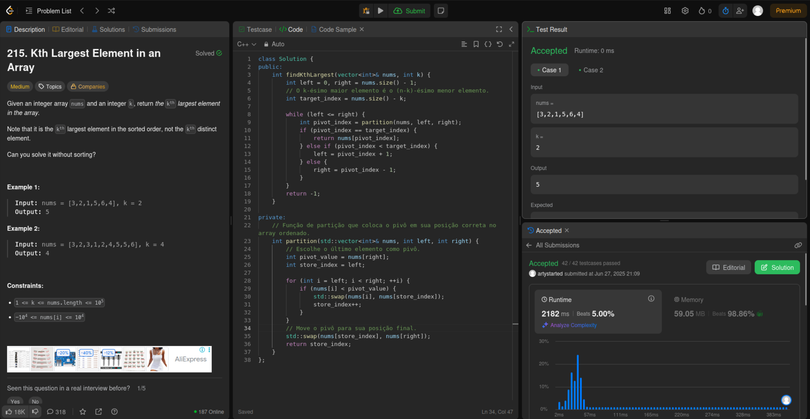

# Grafos1_CodeQuest

**Número da Lista**: 4
**Conteúdo da Disciplina**: Dividir e Conquistar

## Alunos

| Matrícula   | Aluno                                                              |
|-------------|--------------------------------------------------------------------|
| 25/1005945  | [Atyrson Souto da Silva](https://github.com/Atyrson)              |
| 21/1063111  | [Gustavo Alves de Souza](https://github.com/gustaallves)          |

## Sobre

Este projeto foi desenvolvido como parte da disciplina de Projeto de Algoritmos e reúne a resolução de diversos exercícios do <a href="https://leetcode.com/problemset/">Leetcode</a> envolvendo estruturas de dados e técnicas de algoritmos. As questões foram divididas entre os integrantes do grupo, de forma que cada um resolveu 2 questões difíceis e 1 de nível médio.

## Screenshots

###  [Atyrson Souto da Silva](https://github.com/Atyrson)

####  Questões Difíceis

<table border="1">
  <thead>
    <tr>
      <th>Questão</th>
      <th>Resolução</th>
      <th>Vídeo Explicativo</th>
    </tr>
  </thead>
  <tbody>
    <tr>
      <td><a href="https://leetcode.com/problems/median-of-two-sorted-arrays/">4. Median of Two Sorted Arrays</a></td>
      <td><a href="./4.cpp">4.cpp</a></td>
      <td><a href="https://youtu.be/bnX9ROROBgg">Link</a></td>
    </tr>
    <tr>
      <td><a href="https://leetcode.com/problems/reverse-pairs/">493. Reverse Pairs</a></td>
      <td><a href="./493.cpp">493.cpp</a></td>
      <td><a href="https://youtu.be/bnX9ROROBgg">Link</a></td>
    </tr>
  </tbody>
</table>

  
<strong>Imagem 1 - Resolução do exercício 4</strong>

  
<strong>Imagem 2 - Resolução do exercício 493</strong>

####  Questão Média

<table border="1">
  <thead>
    <tr>
      <th>Questão</th>
      <th>Resolução</th>
      <th>Vídeo Explicativo</th>
    </tr>
  </thead>
  <tbody>
    <tr>
      <td><a href="https://leetcode.com/problems/kth-largest-element-in-an-array/">215. Kth Largest Element in an Array</a></td>
      <td><a href="./215.cpp">215.cpp</a></td>
      <td><a href="https://youtu.be/bnX9ROROBgg">Link</a></td>
    </tr>
  </tbody>
</table>

  
<strong>Imagem 3 - Resolução do exercício 215</strong>

---

###  [Gustavo Alves de Souza](https://github.com/gustaallves)

####  Questões Difíceis

<table border="1">
  <thead>
    <tr>
      <th>Questão</th>
      <th>Resolução</th>
      <th>Vídeo Explicativo</th>
    </tr>
  </thead>
  <tbody>
    <tr>
      <td><a href="https://leetcode.com/problems/sum-of-distances-in-tree/">834. Sum of Distances in Tree</a></td>
      <td><a href="./834.py">834.py</a></td>
      <td><a href="https://youtu.be/XC3G_0KR_h4">Link</a></td>
    </tr>
    <tr>
      <td><a href="https://leetcode.com/problems/shortest-path-visiting-all-nodes/">847. Shortest Path Visiting All Nodes</a></td>
      <td><a href="./847.py">847.py</a></td>
      <td><a href="https://youtu.be/XC3G_0KR_h4">Link</a></td>
    </tr>
  </tbody>
</table>

  
<strong>Imagem 4 - Resolução do exercício 834</strong>

  
<strong>Imagem 5 - Resolução do exercício 847</strong>

####  Questão Média

<table border="1">
  <thead>
    <tr>
      <th>Questão</th>
      <th>Resolução</th>
      <th>Vídeo Explicativo</th>
    </tr>
  </thead>
  <tbody>
    <tr>
      <td><a href="https://leetcode.com/problems/binary-tree-level-order-traversal/">102. Binary Tree Level Order Traversal</a></td>
      <td><a href="./102.py">102.py</a></td>
      <td><a href="https://youtu.be/XC3G_0KR_h4">Link</a></td>
    </tr>
  </tbody>
</table>

  
<strong>Imagem 6 - Resolução do exercício 102</strong>

---

## Como usar o código no LeetCode

Este código foi desenvolvido para ser executado diretamente no **LeetCode**.

### Passos para usar:

1. **Copie o código** do arquivo.
2. **Cole o código no editor do LeetCode**.
3. **Submeta o código**. O LeetCode fornecerá as entradas automaticamente durante a execução.
4. **O LeetCode executará o código** com as entradas fornecidas e devolverá a resposta.

### Detalhes adicionais:

- O LeetCode gerencia as **entradas e saídas automaticamente**.
